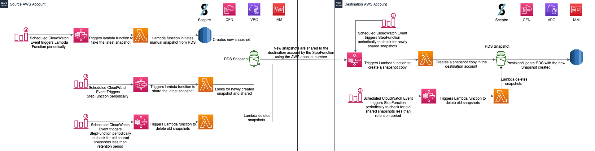

# rds-snapshot-automation
A solution to provide AWS RDS snapshotting automation using sceptre and CloudFormation

## **Solution overview**

The solution leverages Infrastructure as Code, IaC, to provision all resources unless mentioned otherwise. It includes CI/CD Pipelines to automate and streamline application deployments. The solution is been inspired from [Snapshot Tool for Amazon RDS](https://github.com/awslabs/rds-snapshot-tool) solution.

The solution caters to adopt a multi-account strategy that will isolate important business functions such as billing, access, and applications. This will increase security and resilience of the environment and ensure the ability to recover in a disaster scenario. The scope of this DR solution is to obtain a **Recovery Point Objective** (RPO) of **1Hour** and **Recovery Time Objective** (RTO) of **3Hours** under the disaster scenarios of **Account compromise** and **Data Change/Corruption**.

The following diagrams depicts the architectural design for the Disaster Recovery:

The Disaster Recovery approach obtained here is called the **Pilot Light**  where the data is mirrored, the environment is scripted as a template and a minimal version of the system is always running in a different region. The idea comes from the gas heater analogy where a small flame is always on and can quickly ignite the entire furnace, when required. The core element of the system, usually the database, is always activated for data replication and for the other layers, server images are created and updated periodically.

In case of a disaster, the environment can be built out and scaled using the backed-up amazon machine images (AMIs) around the pilot light. The Pilot Light approach reduces the RTO and RPO and provides the ease of just turning on the resources. AWS CloudFormation can be used to automate provisioning of services. Apart from slightly higher costs, the overheads include testing, patching and configuring the services to ensure they match the production environment. More information on AWS Diaster Recovery approaches in [here](https://aws.amazon.com/blogs/publicsector/rapidly-recover-mission-critical-systems-in-a-disaster/).

### **RDS Data**

Automating the cross account sharing of latest snapshots of the production RDS instances is leveraged to implement having the RDS instances on the DR account is always in sync with the production RDS until the time of DR FailOver. To achieve the RPO of 1 Hour, the latest snapshot is set to be taken every 1 Hour on the production RDS instance.

#### **Automation Implementation**

Automation involves the task of creating manual snapshots, copying them into a different account and a different region, and deleting them after a specified number of days which are differentiated in four different steps as below. AWS Resources currently leveraged for this tasks are CloudWatch Event Rules, Step Functions and Lambda Functions (including logging and monitoring). AWS CloudFormation is leveraged in provisioning the resources and maintaining the state of the infrastructure to avoid manual intervention to the automation.

- **Backup RDS SnapShot**
- **Share RDS Snapshot**
- **Copy RDS Snapshot**
- **Delete RDS Snapshot**

##### **Prerequisites for RDS Snapshots Automation**

- **AWS KMS Customer Keys** should exist on both the source and destination account. Appropriate permissions are assigned to both the keys. Made sure that the destination account is having access to the KMS key in the source account. This is required as the the copy snapshot operation needs the source KMS key for it to copy the shared snapshot (which was encrypted using the same source KMS key) locally.

- **RDS instance encrypted with AWS Customer KMS Key** is required for the current production RDS instance for cross account sharing of the RDS snapshots to work. Same AWS Customer KMS key should be used to encrypt the snapshots which will be shared to the DR account. Cross Account sharing of RDS Snapshots is not supported when RDS instance is encrypted with AWS managed KMS Keys.

- **Manual RDS Snapshots Limit** should not be hit on the account level. By default, 100 manual RDS snapshots are allowed per RDS per AWS account. This can be increased by raising AWS support Limit Increase Request and the maximum limit can be increased is 700. This constraint has to be dealt in both the AWS accounts.

##### **In the Source Account**

A CloudWatch Event is scheduled to trigger Step Function [State Machine](./img/take_snapshot.png) every Hour to **Take Snapshots** from the production RDS. That state machine invokes a lambda function which is executed to take the snapshot from the target. That function triggers a snapshot and applies some standard tags. It matches RDS instances using a regular expression on their names (currently the exact name of the DB identifier is passed via the SSM Parameter Store).

There are two other state machines and lambda functions. The [state machine](./img/share_snapshot.png) for **Share Snapshots** looks for new snapshots created by the TakeSnapshots lambda function. When it finds them, it shares them with the destination account. This state machine is set to triggered every 90 minutes by a another CloudWatch event rule. If it finds a new snapshot that is intended to be shared, it shares the snapshot.

The other [state machine](./img/delete_old_snapshot.png) is to Delete Old Snapshots and it calls it's specific lambda function to **Delete Snapshots** according to the RetentionDays parameter. when the stack is launched. This state machine is set to run at a particular time in the night every day. If it finds a snapshot that is older than the retention time, it deletes the snapshot. The RetentionDays parameter is currently set to 1 day to avoid hitting AWS Manual Snapshots limit and running cost of RDS snapshots.

Monitoring is set on the Step Functions to monitor the states of the state machines running. Any failed states will be notified via SNS notifications. Above three automation has it's dedicated CloudFormation templates which are provisioned in the source account targeting the source RDS instances.

###### **CloudFormation Templates Description**

|       Parameter      |                                                                                                                                                                                                                                                                                                                    Description                                                                                                                                                                                                                                                                                                                   |
|:--------------------:|:------------------------------------------------------------------------------------------------------------------------------------------------------------------------------------------------------------------------------------------------------------------------------------------------------------------------------------------------------------------------------------------------------------------------------------------------------------------------------------------------------------------------------------------------------------------------------------------------------------------------------------------------:|
| BackupInterval       | how many hours between backup                                                                                                                                                                                                                                                                                                                                                                                                                                                                                                                                                                                                                    |
| BackupSchedule       | at what times and how often to run backups. Set in accordance with BackupInterval. For example, set BackupInterval to 8 hours and BackupSchedule 0 0,8,16 * * ? * if you want backups to run at 0, 8 and 16 UTC. If your backups run more often than BackupInterval, snapshots will only be created when the latest snapshot is older than BackupInterval. If you set BackupInterval to more than once a day, make sure to adjust BackupSchedule accordingly or backups will only be taken at the times specified in the Rate expression.                                                                                                        |
| ShareSchedule        | at what times and how often to run sharing snapshots. Set in accordance with BackupSchedule.                                                                                                                                                                                                                                                                                                                                                                                                                                                                                                                                                               |
| DeleteSchedule       | at what times and how often to run deleting old snapshots. Set in accordance with ShareSchedule.                                                                                                                                                                                                                                                                                                                                                                                                                                                                                                                                                                |
| InstanceNamePattern  | set to the names of the instances you want this tool to back up. You can use a Python regex that will be searched in the instance identifier. Currently it set to point to the production RDS DB Instance   Identifier.                                                                                                                                                                                                                                                                                                                                                                                           |
| DestinationAccount   | the account where you want snapshots to be copied to                                                                                                                                                                                                                                                                                                                                                                                                                                                                                                                                                                                             |
| LogLevel             | The log level you want as output to the Lambda functions. ERROR is usually enough. You can increase to INFO or DEBUG.                                                                                                                                                                                                                                                                                                                                                                                                                                                                                                                            |
| RetentionDays        | the amount of days you want your snapshots to be kept. Snapshots created more than RetentionDays ago will be automatically deleted (only if they contain a tag with Key: CreatedBy, Value: Snapshot Tool for RDS)                                                                                                                                                                                                                                                                                                                                                                                                                                |
| ShareSnapshots       | Set to TRUE if you are sharing snapshots with a different account. If you set to FALSE, StateMachine, Lambda functions and associated CloudWatch Alarms related to sharing across accounts will not be created. It is useful if you only want to take backups and manage the retention, but do not need to copy them across accounts or regions.                                                                                                                                                                                                                                                                                                 |
| SourceRegionOverride | if you are running RDS on a region where Step Functions is not available, this parameter will allow you to override the source region. For example, at the time of this writing, you may be running RDS in Northern California (us-west-1) and would like to copy your snapshots to Montreal (ca-central-1). Neither region supports Step Functions at the time of this writing so deploying this tool there will not work. The solution is to run this template in a region that supports Step Functions (such as North Virginia or Ohio) and set SourceRegionOverride to us-west-1. IMPORTANT: deploy to the closest regions for best results. |
| DeleteOldSnapshots   | Set to TRUE to enable functionality that will delete snapshots after RetentionDays. Set to FALSE if you want to disable this functionality completely. (Associated Lambda and State Machine resources will not be created in the account). WARNING If you decide to enable this functionality later on, bear in mind it will delete all snapshots, older than RetentionDays, created by this tool; not just the ones created after DeleteOldSnapshots is set to TRUE.                                                                                                                                                                            |
| TaggedInstance       | Set to TRUE to enable functionality that will only take snapshots for RDS Instances with tag CopyDBSnapshot set to True. The settings in InstanceNamePattern and TaggedInstance both need to evaluate successfully for a snapshot to be created (logical AND).                                                                                                                                                                                                                                                                                                                                                                                   |
|                      |                                                                                                                                                                                                                                                                                                                                                                                                                                                                                                                                                                                                                                                  |

##### **In the Destination Account**

There are two state machines and corresponding lambda functions. The [state machine](./img/copy_snapshot.png) for **Copy Snapshots** looks for new snapshots that have been shared but have not yet been copied. When it finds them, it creates a copy in the destination account, encrypted with the KMS key that has been stipulated. This state machine is set to triggered every 100 minutes by a another CloudWatch event rule. The RetentionDays parameter is currently set to 2 days to as the lambda function that is executed for copying snapshots will copy only that snapshots that is newer than the retention days. If the retention is 1 day or less than 1 day old, the latest snapshots will be missed copying.

The other state machine is just like the corresponding state machine and function in the source account. The [state machine](./img/delete_old_snapshot.png) for **Delete Snapshots** and it calls it's corresponding lambda function to delete snapshots according to the RetentionDays parameter when the stack is launched. This state machine is set to run at a particular time in the night every day. If it finds a snapshot that is older than the retention time, it deletes the snapshot. The RetentionDays parameter is currently set to 1 day to avoid hitting AWS Manual Snapshots limit and running cost of RDS snapshots.

Monitoring is set on the Step Functions to monitor the states of the state machines running. Any failed states will be notified via SNS notifications. Above two automation has it's dedicated CloudFormation templates which are provisioned in the destination account targeting the DR RDS instances.

###### **CloudFormation Templates Description**

| Parameter          | Description                                                                                                                                                                                                                                                                                                                                                                                                                                                           |
|--------------------|-----------------------------------------------------------------------------------------------------------------------------------------------------------------------------------------------------------------------------------------------------------------------------------------------------------------------------------------------------------------------------------------------------------------------------------------------------------------------|
| DestinationRegion  | the region where you want your snapshots to be copied. If you set it to the same as the source region, the snapshots will be copied from the source account but will be kept in the source region. This is useful if you would like to keep a copy of your snapshots in a different account but would prefer not to copy them to a different region.                                                                                                                  |
| SnapshotPattern    | similar to InstanceNamePattern. See above                                                                                                                                                                                                                                                                                                                                                                                                                             |
| CopySchedule       | at what times and how often to run copying the snapshots. Set in accordance with ShareSchedule. See Above                                                                                                                                                                                                                                                                                                                                                             |
| DeleteSchedule     | at what times and how often to run deleting old snapshots. Set in accordance with CopySchedule.                                                                                                                                                                                                                                                                                                                                                                       |
| DeleteOldSnapshots | Set to TRUE to enable functionality that will delete snapshots after RetentionDays. Set to FALSE if you want to disable this functionality completely. (Associated Lambda and State Machine resources will not be created in the account). WARNING If you decide to enable this functionality later on, bear in mind it will delete ALL SNAPSHOTS older than RetentionDays created by this tool, not just the ones created after DeleteOldSnapshots is set to TRUE. |
| CrossAccountCopy   | if you only need to copy snapshots across regions and not to a different account, set this to FALSE. When set to false, the no-x-account version of the Lambda functions will be deployed and will expect snapshots to be in the same account as they run.                                                                                                                                                                                                            |
| KmsKeySource       | KMS Key to be used for copying encrypted snapshots on the source region. If you are copying to a different region, you will also need to provide a second key in the destination region.                                                                                                                                                                                                                                                                              |
| KmsKeyDestination  | KMS Key to be used for copying encrypted snapshots to the destination region. If you are not copying to a different region, this parameter is not necessary.                                                                                                                                                                                                                                                                                                          |
| CopyRetentionDays  | as in the source account, the amount of days you want your snapshots to be kept. Do not set this parameter to a value lower than the source account. Snapshots created more than RetentionDays ago will be automatically copied (only if they contain a tag with Key: CopiedBy, Value: Snapshot Tool for RDS)                                                                                                                                                         |
| RetentionDays      | as in the source account, the amount of days you want your snapshots to be kept. Do not set this parameter to a value lower than the source account. Snapshots created more than RetentionDays ago will be automatically deleted (only if they contain a tag with Key: CopiedBy, Value: Snapshot Tool for RDS)